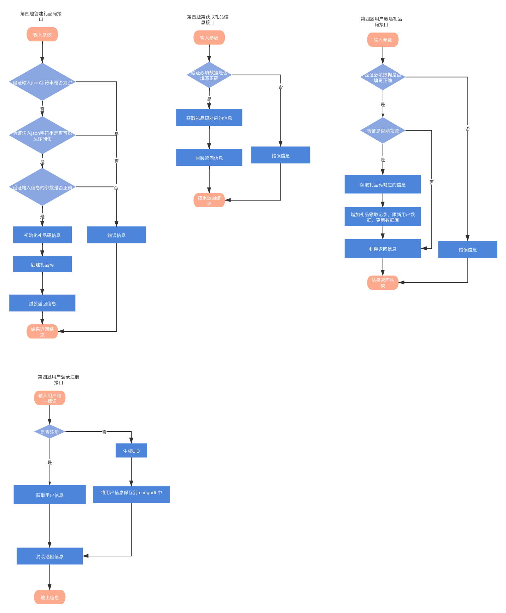

## 1.整体框架

本服务根据加载配置文件进行启动http服务，提供用户注册和领取激活码功能

## 2.目录结构

```
├── app
│   ├── http
│   │   └── httpServer.go #http服务
│   └── main.go #程序入口
├── config #配置文件
│   └── app.ini
├── go.mod
├── internal
│   ├── ctrl #控制器层
│   │   ├── GiftCodesController.go
│   │   └── UsersController.go
│   ├── handler #handler层
│   │   ├── GiftCodesHandler.go
│   │   ├── GiftCodesHandler_test.go
│   │   ├── UsersHandler.go
│   │   └── Usershandler_test.go
│   ├── model #模型层
│   │   ├── GeneralReward.pb.go
│   │   ├── GeneralReward.proto
│   │   ├── Gift.go
│   │   ├── Result.go
│   │   └── Users.go
│   ├── router #路由层
│   │   └── GiftCodesRouter.go
│   ├── service #service层
│   │   ├── GiftCodesService.go
│   │   └── UserService.go
│   └── utils #工具层
│       ├── IniUtils.go
│       ├── MongodbUtils.go
│       ├── RedisUtils.go
│       └── random.go
├── locust #压力测试
│   ├── LocustFile.py
│   └── report_1627906730.423639.html
└── readme.md
```


## 3.代码逻辑分层

| 层        | 文件夹                  | 主要职责                             | 调用关系                  | 其他说明         |
| --------- | ----------------------- | ------------------------------------ | ------------------------- | ---------------- |
| 应用层    | /app/http/httpServer.go | 进程启动，server初始化               | 调用路由层                | 不可同层相互调用 |
| 路由层    | /internal/router        | 路由转发，http的path                 | 调用控制层，被应用层调用  | 不可同层相互调用 |
| 控制层    | /internal/ctrl          | 请求参数验证、处理请求后构造回复消息 | 调用handler，被路由层调用 | 不可同层相互调用 |
| handler层 | /internal/handler       | 处理具体业务逻辑                     | 调用模型层，被控制层调用  | 不可同层相互调用 |
| 模型层    | /internal/model         | 数据模型                             | 被业务逻辑层调用          | 不可同层相互调用 |
| service层 | /internal/service       | 通用业务逻辑                         | 被handler调用             | 不可同层相互调用 |
| 工具层    | /internal/utils         | 工具层                               | 被各层调用                | 不可同层相互调用 |
| config层  | /config                 | 存放配置文件和日志文件               |                           |                  |

## 4.存储设计

礼品设计

| 内容   | 数据库 | field | 类型 |
| ------ | ------ | ----- | ---- |
| 礼品id | 无     | Id    | int  |
| 数量   | 无     | Num   | int  |

领取记录

| 内容           | 数据库 | field       | 类型   |
| -------------- | ------ | ----------- | ------ |
| 用户id         | 无     | Name        | string |
| 领取时间时间戳 | 无     | Num         | int64  |
| 领取时间字符串 | 无     | PullTimeStr | string |

领取码

| 内容                          | 数据库 | field         | 类型   |
| ----------------------------- | ------ | ------------- | ------ |
| 用户id                        | 无     | CreateUserId  | string |
| 创建时间戳                    | 无     | CreateTime    | int64  |
| 礼品码描述                    | 无     | GiftDescribe  | string |
| 礼品内容                      | 无     | GiftList      | slice  |
| 礼品码类型                    | 无     | GiftCodeType  | string |
| 礼品码可领次数                | 无     | GiftPullNum   | int    |
| 有效时间字符串                | 无     | ValidityStr   | string |
| 有效时间时间戳                | 无     | Validity      | int64  |
| 礼品码被领取次数              | 无     | GiftPulledNum | int    |
| 礼品码                        | 无     | GiftCode      | string |
| 领取记录                      | 无     | RecordList    | slice  |
| 礼品限制领取人(限制A类礼品码) | 无     | GiftPullUser  | string |

用户信息

| 内容             | 数据库  | field    | 类型   |
| ---------------- | ------- | -------- | ------ |
| UID              | mongodb | UID      | string |
| id(用户唯一标识) | mongodb | Id       | string |
| 金币数           | mongodb | GoldNum  | int    |
| 钻石数           | mongodb | JewelNum | int    |

通用奖励消息

| 内容               | 数据库 | field   | 类型              |
| ------------------ | ------ | ------- | ----------------- |
| 状态码             | 无     | Code    | int32             |
| 消息               | 无     | Msg     | string            |
| 客户端展示奖励部分 | 无     | Changes | map[uint32]uint64 |
| 道具变化前余额     | 无     | Balance | map[uint32]uint64 |
| 计数器当前值       | 无     | Counter | map[uint32]uint64 |
| 扩展字段           | 无     | Ext     | string            |

返回结果设计

| 内容     | 数据库 | field | 类型        |
| -------- | ------ | ----- | ----------- |
| 状态码   | 无     | Code  | string      |
| 返回消息 | 无     | Msg   | string      |
| 返回结果 | 无     | Data  | interface{} |


## 5.接口设计

### 5.1第一个接口 - go实现

#### 接口功能

根据客户端传递唯一识别码（一个任意字符串）至服务器，服务器通过该识别码判断是否存在该玩家：不存在则注册新用户，生成唯一UID；存在则返回用户登陆数据（唯一UID、金币数、钻石数）。玩家信息储存在mongo数据库中。

#### HTTP请求方式

POST

#### 请求路径

localhost:8000/registerUser

#### 请求参数

| 参数 | 必选 | 类型 | 说明           |
| ---- | ---- | ---- | -------------- |
| Id   | true | text | 用户唯一标识符 |

```json
{
  "id":"100001"
 
}
```


#### 请求响应

```json
{
    "code": 200,
    "data": {
        "UID": "KtcbIXAVxlOSjOdjUthuKs5H",
        "Id": "100001",
        "GoldNum": 20,
        "JewelNum": 20
    },
    "message": "OK"
}
```

### 5.2第二个接口 - go实现

#### 接口功能

根据一个创建礼品码信息对应的json字符串，后台反序列化json字符串，验证允许创建礼品码后，返回礼品码。

#### HTTP请求方式

POST

#### 请求路径

localhost:8000/createGiftCodes

#### 请求参数

| 参数    | 必选 | 类型 | 说明                   |
| ------- | ---- | ---- | ---------------------- |
| jsonStr | true | text | 礼品码信息的json字符串 |

```json
{
  "jsonStr":"{
  "createUserId":"1000",
  "giftDescribe":"礼品码1",
  "giftList":[{"id":1001,"num":10},{"id":1002,"num":10}],
  "giftCodeType":"A",
  "validityStr":"2021-08-30 10:23:33",
  "giftPullUser":"100001"
}"
 
}
```


#### 请求响应

```json
{
    "code": 200,
    "data": "创建成功，礼品码是：ZDJ4UFAD",
    "message": "OK"
}
```

### 5.3第三个接口 - go实现

#### 接口功能

根据一个礼品码获取该礼品码对应的信息

#### HTTP请求方式

POST

#### 请求路径

localhost:8000/getCiftCodes

#### 请求参数

| 参数     | 必选 | 类型 | 说明   |
| -------- | ---- | ---- | ------ |
| giftCode | true | text | 礼品码 |

```json
{
  "giftCode":"KLPPQL9Z"
  
}
```


#### 请求响应

```json
{
    "code": 200,
    "data": {
        "createUserId": "1000",
        "createTime": 1627876878,
        "giftDescribe": "礼品码1",
        "giftList": [
            {
                "name": "士兵",
                "num": 10
            },
            {
                "name": "金币",
                "num": 10
            }
        ],
        "giftCodeType": "A",
        "giftPullNum": 0,
        "validityStr": "2021-08-30 10:23:33",
        "validity": 1630290213,
        "giftPulledNum": 1,
        "giftCode": "KLPPQL9Z",
        "recordList": [
            {
                "userid": "100001",
                "pullTime": 1627876924,
                "pullTimeStr": "2028-12-02 12:02:04"
            }
        ],
        "giftPullUser": "100001"
    },
    "message": "OK"
}
```

### 

### 5.4第四个接口 - go实现

#### 接口功能

根据礼品码和用户唯一标识，验证该用户是否能领取该礼品，能则将礼品信息添加到用户信息中，并且使用通用消息使用protobuf序列化返回。

#### HTTP请求方式

POST

#### 请求路径

localhost:8000/activateCode

#### 请求参数

| 参数     | 必选 | 类型 | 说明   |
| -------- | ---- | ---- | ------ |
| giftCode | true | text | 礼品码 |

```json
{
  "giftCode":"25EXYA5U"
  
}
```


#### 请求响应

```json
�成功"�2"�2*�2*�2
```

#### 响应状态码

| 状态码 | 说明                        |
| ------ | --------------------------- |
| 200    | 成功                        |
| 201    | 请输入创建礼品码信息        |
| 202    | 后台反序列化出错            |
| 203    | 有效期时间格式不正确        |
| 204    | 创建人不能为空              |
| 205    | 礼品码中礼品内容不能为空    |
| 206    | 礼品内容中礼品id不能为空    |
| 207    | 礼品内容中礼品数量不能小于0 |
| 208    | 有效时间不能小于创建时间    |
| 209    | 请选择礼品码类别            |
| 210    | 领取人不能为空              |
| 211    | 可领取次数不能为空          |
| 212    | 后台数据序列化出错          |
| 213    | redis存储失败               |
| 214    | redis中不存在该礼品码       |
| 215    | redis获取数据失败           |
| 216    | 该礼品码已过期              |
| 217    | 礼品码已领取                |
| 218    | 你不可使用该礼品码          |
| 219    | 该礼品码已被领取完          |
| 220    | 礼品码无效                  |
| 221    | 请输入礼品码参数            |
| 222    | 请输入用户id参数            |
| 223    | protobuf序列化出错          |
| 224    | mongodb更新失败             |
| 225    | 用户没有注册登陆            |
| 226    | mongodb查询失败             |

#### 响应消息说明

| 字段    | 说明       |
| ------- | ---------- |
| code    | 响应状态码 |
| data    | 响应数据   |
| message | 响应信息   |

#### 通用消息说明

| 字段    | 说明                     |
| ------- | ------------------------ |
| code    | 响应状态码               |
| msg     | 响应信息                 |
| changes | 客户端展示奖励的部分     |
| balance | 道具有变化部分的当前余额 |
| counter | 计数器当前值             |

#### 礼品信息

| 礼品id | 礼品内容 |
| ------ | -------- |
| 1001   | 金币     |
| 1002   | 钻石     |


## 6.第三方库

### gin

```
用于http服务创建代码  https://github.com/gin-gonic/gin
```

### Redis

```
用于连接redis，对redis进行操作 https://github.com/go-redis/redis
```

### mongodb

```
用于连接mongodb，对mongodb进行操作 https://go.mongodb.org/mongo-driver/mongo 
```

### protobuf

```
 用户生成protobuf存储信息  https://github.com/golang/protobuf/protoc-gen-go
```


## 7.如何编译执行

在app文件目录下编译main.go文件后生成可执行文件main，将可执行文件文件放到根目录下进行执行。

在项目执行可执行文件的执行命令

```sh
./main
```

在app目录下执行main.go时需要设置working directory为项目根路径


在单元测试代码目录下执行go test时设置working directory为项目根路径


## 8.todo

1.后续的项目结构优化。

## 流程图




